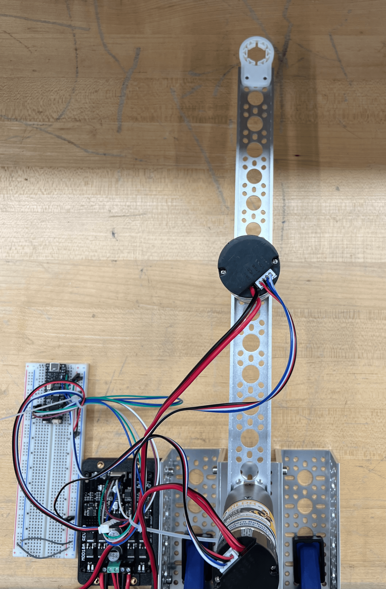
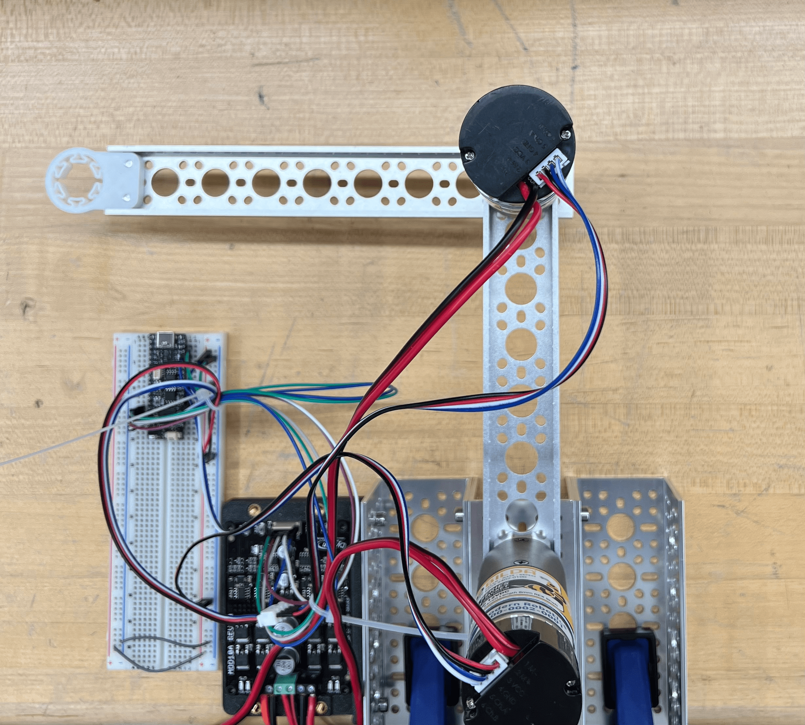
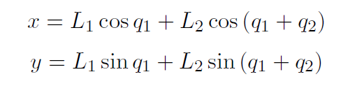
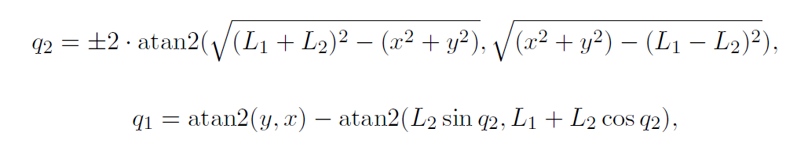

# Lab 3: 2-DoF Robot Kinematics

2.12/2.120 Intro to Robotics  
Spring 2024[^1]

- [1 Validate Hardware Setup](#1-validate-hardware-setup)
  - [1.1 Validate Microcontroller](#11-validate-microcontroller)
  - [1.2 Validate Motors](#12-validate-motors)
  - [1.3 Validate Encoders](#13-validate-encoders)
  - [1.4 Validate Joystick](#14-validate-joystick)
- [2 Validate Serial Read](#2-validate-serial-read)
- [3 Step Response in Joint Space](#3-step-response-in-joint-space)
  - [3.1 Straight Arm](#31-straight-arm)
  - [3.2 Bent Elbow](#32-bent-elbow)
- [4 Forward Kinematics](#4-forward-kinematics)
- [5 Inverse Kinematics](#5-inverse-kinematics)
- [6 Cartesian Space](#6-cartesian-space)
  - [6.1 Vertical Line](#61-vertical-line)
  - [6.2 Joystick](#62-joystick)
- [7 Feedback Form](#7-feedback-form)
- [X Optional](#x-optional)

## 1 Validate Hardware Setup
Estimated time of completion: 10 min

Before beginning any work with hardware, it's important to make sure all of it works! Faulty wiring or hardware is often a simple bug, but can be very difficult to find with a lot of moving parts in software.

### 1.1 Validate Microcontroller

**Make sure that motor power is turned off any time you are uploading code to your microcontroller.** The arm has a tendency to spin around and hit itself if motor power is on during upload. 

Clone this repository and run `robot/blink_test.cpp`. You should see the onboard LED change colors! 

 
 <i> Forget how to clone? </i> 

Please refer to the [instructions from Lab 1](
https://github.com/mit212/lab1_2024?tab=readme-ov-file#31-git-clone).

### 1.2 Validate Motors

Orient the arm so that it points straight up (+y direction) in full extension. This should always be the starting position of the arm.  

Then, run `test_code/motor_drive_test.cpp` to validate your motor setup. You can turn on motor power after clicking `RST`. You should see both motors oscillating back and forth. Remember that motor 1 is attached to the base (acts like a shoulder), and motor 2 is attached to the second link (acts like an elbow). 

As a reminder, motor power should only be on when you expect the motor to move, such as in this section. Otherwise, please keep motor power off. The yellow LED on the motor driver indicates whether motor power is on or off.

### 1.3 Validate Encoders
Run `test_code/encoder_test.cpp` to validate your encoder setup. Remember to open the Serial Monitor to see the output. Make sure that both the direction and the magnitude make sense!

### 1.4 Validate Joystick
Run `lab_code/joystick.cpp` and `test_code/joystick_test.cpp` to validate your joystick setup. **This means you should move both files into the `robot/` directory.** You should be able to see joystick readings within the range `[-1, 1]`.

## 2 Validate Serial Read
Estimated time of completion: 10 min

In order to visualize data, we need to plot it in MATLAB. To verify that the interface between the microcontroller and MATLAB works, we will plot the outputs of `test_code/encoder_test.cpp`.

1. Open `test_code/encoder_test.cpp`. Comment out `#define SerialMonitor` and uncomment `#define MatlabPlot`. This reformats the prints in the Serial Monitor to be readable by MATLAB.
2. Run `test_code/encoder_test.cpp`, but this time, **don't open the Serial Monitor**. If you already have it open, close it by clicking the delete icon or typing `Ctrl+C` in the Serial Monitor.
3. Find your microcontroller port by clicking the plug icon with the word "Auto" next to it at the bottom of the screen. The port name should be similar to `COM10` in Windows or `/dev/cu.usbmodem144101` in MacOS.
4. Open `src/matlab/SerialTest.m` in MATLAB.
5. Change the port name in `s1 = serialport(...)` (lines 28-29).
6. Run `src/matlab/SerialTest.m`. You should see four lines representing encoder positions and velocities. Feel free to rotate the links to verify that the values change accordingly.
7. Close the plot and enter `clear` in the Command Window at the bottom of the screen in MATLAB. This will make sure your serial port is freed up so you can upload to the microcontroller later.

## 3 Step Response in Joint Space
Estimated time of completion: 20 min

### 3.1 Straight Arm
Set the arm to be straight up in default position:

Then, run `lab_code/step_response.cpp` and set the power supply voltage to around `10V`. The arm should oscillate between `theta1 = 0` and `theta1 = -M_PI/4`.

To examine the step response in more detail, run `matlab/StepResponsePlot.m` in MATLAB. Make sure to change the port name (lines 27-28) before running as needed. If your controller is properly tuned, the step response should have minimal overshoot, oscillations, and steady state error. 

Hit the STOP button on MATLAB after collecting some data and take a screenshot of the plot. 

### 3.2 Bent Elbow
Set the arm to be bent 90 degrees to the left at the elbow:

Then, run `lab_code/step_response.cpp` and `matlab/StepResponsePlot.m` in MATLAB again. *Note: This is the only time we want the arm not to be in default starting position.* 

Hit the STOP button on MATLAB after collecting some data and take a screenshot of the plot.  

| :white_check_mark: CHECKOFF 1 :white_check_mark:   |
|:---------------------------------------------------|
| Show a TA or LA the screenshots of your plots. Identify and explain any differences in the step response between the straight arm and bent arm configurations. |

## 4 Forward Kinematics
Estimated time of completion: 10 min

For a 2-DoF arm with the following coordinate system

We know from lecture that the forward kinematics equations are given by 

Open `lab_code/kinematics.cpp` and fill in `TODO 1` using the equations above. Please read the comments for hints.

To check your implementation, run `lab_code/kinematics.cpp` and `test_code/forward_kinematics_test.cpp`. In MATLAB, run `matlab/PathPlot.m`. Make sure to change the port name (lines 27-28) before running as needed. Move the arm around and confirm that line on the plot traces the path of the end-effector. 

## 5 Inverse Kinematics
Estimated time of completion: 10 min

Consequently, we know from lecture that the inverse kinematics equations of the 2-DoF arm are given by 

Open `lab_code/kinematics.cpp` and fill in `TODO 2` using the equations above. Please read the comments for hints.

To check your implementation, then run `lab_code/kinematics.cpp` and `test_code/inverse_kinematics_test.cpp`. Open the Serial Monitor and move the arm around. Confirm that `theta1_error` and `theta2_error` are `0`.

| :white_check_mark: CHECKOFF 2 :white_check_mark:   |
|:---------------------------------------------------|
| Demonstrate `test_code/inverse_kinematics_test.cpp` to a TA or LA  |

## 6 Cartesian Space
Estimated time of completion: 10 min

Now that we implemented inverse kinematics, we can follow any trajectory we want in Cartesian space by translating the setpoints to joint space!

Open `lab_code/drawing.cpp`. Complete `TODO 1` to update `newSetpoint` using the `inverseKinematics` function.

### 6.1 Vertical Line

Now, run `lab_code/joystick.cpp`, `lab_code/kinematics.cpp`, and `lab_code/drawing.cpp`. The end-effector should roughly trace a 10cm vertical line. 

To see a direct comparison between the target and actual trajectories, run `matlab/TrajectoryPlot.m`. Make sure to change the port name (lines 27-28) before running as needed. Hit the STOP button on MATLAB after collecting some data and take a screenshot of the plot. 

### 6.2 Joystick

Set `trajectoryType` to `JOYSTICK` in `TODO 2`. Then, complete `TODO 3` to translate the joystick reading into a reasonable setpoint in Cartesian space. 

Repeat the process in the [previous section](#61-horizontal-line) and control the arm using your joystick! Remember to also run `matlab/TrajectoryPlot.m` and take a screenshot of the plot.

| :white_check_mark: CHECKOFF 3 :white_check_mark:   |
|:---------------------------------------------------|
| Show the screenshots of the plots and demonstrate the arm following your joystick command to a TA or LA. |

## 7 Feedback Form

Before you leave, please fill out https://tinyurl.com/212-feedback. 

| :white_check_mark: CHECKOFF 4 :white_check_mark:   |
|:---------------------------------------------------|
| Show the feedback form completion screen to a TA or LA. |

## X Optional

Here are some optional challenges you can try if you finish lab early!

1. Change `trajectory_type` to `HORIZONTAL_LINE`.
2. Change `trajectory_type` to `CIRCLE`.
3. Modify `lab_code/drawing.cpp` to create a fun, unique trajectory.
4. Modify `test_code/inverse_kinematics_test.cpp` so that the errors are always `0` regardless of elbow-up or elbow-down configuration. 
5. Tune the PID gains of both motors.

[^1]: Version 1 - 2016: Peter Yu, Ryan Fish and Kamal Youcef-Toumi  
  Version 2 - 2017: Yingnan Cui, Kamal Youcef-Toumi, Steven Yeung and Abbas Shikari  
  Version 3 - 2019: Daniel J. Gonzalez  
  Version 4 - 2020: Jerry Ng, Steven Yeung, Rachel Hoffman, Kamal Youcef-Toumi  
  Version 5 - 2021: Hanjun Song  
  Version 6 - 2023: Ravi Tejwani and Kentaro Barhydt  
  Version 7 - 2024: Jinger Chong, Josh Sohn
